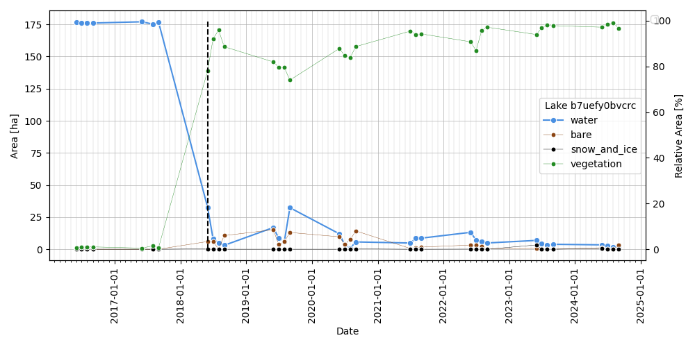
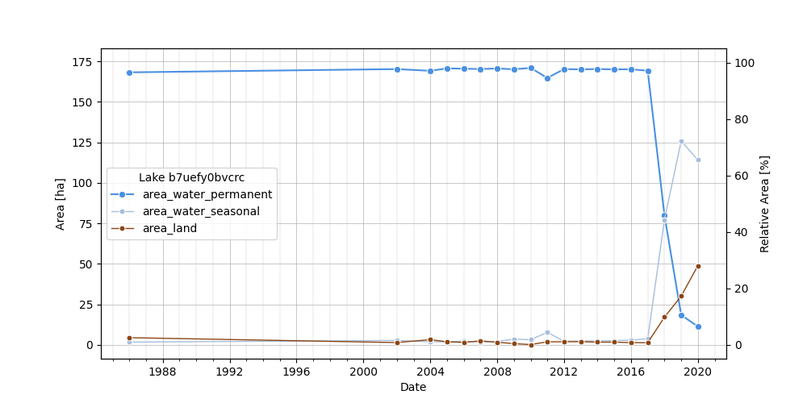

# water-timeseries-v2

Automated analysis of water timeseries data from satellite imagery and remote sensing sources.

## Documentation

**📖 Full Documentation**: [View Documentation](https://PermafrostDiscoveryGateway.github.io/water-timeseries-v2/)

The documentation includes:

- Getting started guide
- API reference (auto-generated from code)
- Usage examples
- Tutorial notebooks

Documentation is automatically built and deployed on every push to `main` using GitHub Actions.

## Features

- **Dynamic World Handler**: Process Dynamic World land cover classifications
- **JRC Water Handler**: Handle JRC water occurrence and classification data
- **Earth Engine Downloader**: Download data directly from Google Earth Engine
- **Data Normalization**: Automatic normalization and scaling of time series
- **Breakpoint Detection**: Statistical (SimpleBreakpoint) and advanced (RBEAST) methods for detecting water extent changes
- **Batch Processing**: Efficient processing of multiple spatial entities
- **Comprehensive Testing**: Full test coverage including breakpoint detection, normalization, and integration tests

## Dashboard

Interactive Streamlit dashboard for visualizing lake polygons and time series data.
For millions of lakes, use **PMTiles** vector tiles (MapLibre GL) instead of loading all polygons into Folium:

```bash
brew install tippecanoe
uv run water-timeseries build-pmtiles lakes.parquet tiles/lakes.pmtiles
uv run water-timeseries dashboard --vector-file lakes.parquet --pmtiles-file tiles/lakes.pmtiles
```

Interactive Streamlit dashboard (Folium mode for smaller datasets):

```bash
export EE_PROJECT=<YOUR GEE PROJECT>
uv run water-timeseries dashboard
```


Features:
- Interactive map with lake polygons from parquet files
- Hover to see attributes (id_geohash, area, net change)
- Click to select and view time series
- Automatic download from Google Earth Engine if data not available
- Satellite timelapse animations (Sentinel-2 and Landsat)


## Quick Start

### Python API

```python
from water_timeseries.dataset import DWDataset
import xarray as xr

# Load data
ds = xr.open_dataset("water_data.nc")

# Process with Dynamic World handler
processor = DWDataset(ds)

# Access time series
water_extent = processor.ds_normalized[processor.water_column]

# Access normalized time series
water_extent = processor.ds_normalized["water"]
```

### Download from Google Earth Engine

```python
import os
from loguru import logger
from water_timeseries.downloader import EarthEngineDownloader

# Set your EE project (or pass directly as ee_project parameter)
os.environ["EE_PROJECT"] = "your-project"

# Create downloader instance
dl = EarthEngineDownloader(ee_auth=True, logger=logger)

# Basic download - download all features
ds = dl.download_dw_monthly(
    vector_dataset="tests/data/lake_polygons.parquet",
    name_attribute="id_geohash",
    years=[2024],
    months=[7, 8],
)

# Download only specific IDs
ds = dl.download_dw_monthly(
    vector_dataset="tests/data/lake_polygons.parquet",
    name_attribute="id_geohash",
    id_list=["b7g6g1ny1mf7", "b7g4yc12k4yj", "b7g6c8gye56e"],  # Filter by specific geohash IDs
    years=[2024],
    months=[7, 8],
)

# Parallel download (faster for large datasets)
ds = dl.download_dw_monthly(
    vector_dataset="tests/data/lake_polygons.parquet",
    name_attribute="id_geohash",
    n_parallel=4,  # Use 4 parallel workers
    max_total_requests=500,  # Request limit per chunk
    years=[2024],
    months=[7, 8],
)

# Preview download without actually downloading (useful for testing)
ds = dl.download_dw_monthly(
    vector_dataset="tests/data/lake_polygons.parquet",
    name_attribute="id_geohash",
    no_download=True,  # Only logs parameters, skips actual download
)

# Save to file (auto-detects format from extension: .zarr or .nc)
ds = dl.download_dw_monthly(
    vector_dataset="tests/data/lake_polygons.parquet",
    name_attribute="id_geohash",
    years=[2024],
    months=[7, 8],
    save_to_file="data.zarr",  # Saves to downloads/data.zarr (relative path)
)

# Absolute path example
ds = dl.download_dw_monthly(
    vector_dataset="tests/data/lake_polygons.parquet",
    name_attribute="id_geohash",
    years=[2024],
    months=[7, 8],
    save_to_file="/path/to/output/data.nc",  # Saves to absolute path as NetCDF
)
```

### Command Line Interface

```bash
# Launch the interactive dashboard
uv run water-timeseries dashboard

# Run breakpoint analysis
uv run water-timeseries breakpoint-analysis-historical \
    data.zarr \
    output.parquet \
    --chunksize 100 \
    --n-jobs 4

# Run Near real-time breakpoint analysis
uv run water-timeseries breakpoint-analysis-nrt \
    --dataset-file data.zarr \
    --analysis-date 2026-06 \
    --output-dir ./output \
```

#### Using a Config File

You can also use a YAML configuration file:

```bash
uv run water-timeseries breakpoint-analysis-historical --config-file configs/config.yaml
```

Example config file:

```yaml
# config.yaml
water_dataset_file: /path/to/data.zarr
output_file: /path/to/output.parquet

# Optional: vector dataset for bbox filtering
vector_dataset_file: /path/to/lakes.parquet

# Bounding box filter (optional)
bbox_west: -160
bbox_east: -155
bbox_north: 68
bbox_south: 66

# Processing options
chunksize: 100
n_jobs: 20
min_chunksize: 10
```

#### CLI Options

| Option | Short | Description | Default |
|--------|-------|-------------|--------|
| `water_dataset_file` | | Path to water dataset (zarr or parquet) | Required* |
| `output_file` | | Path to output parquet file | Required* |
| `--config-file` | | Path to config YAML/JSON file | None |
| `--vector-dataset-file` | `-v` | Path to vector dataset (gpkg, shp, geojson) | None |
| `--chunksize` | `-c` | Number of IDs per chunk | 100 |
| `--n-jobs` | `-j` | Number of parallel jobs (>1 for Ray) | 1 |
| `--min-chunksize` | `-m` | Minimum chunk size | 10 |
| `--bbox-west` | | Minimum longitude (west) | -180 |
| `--bbox-south` | | Minimum latitude (south) | 60 |
| `--bbox-east` | | Maximum longitude (east) | 180 |
| `--bbox-north` | | Maximum latitude (north) | 90 |
| `--output-geometry` | | Export output with geometries | True |
| `--output-geometry-all` | | Export output all geometries including non breakpoints | True |

*Can also be provided via config file

#### Plot Timeseries

Plot time series for a specific lake:

```bash
# Plot lake timeseries
uv run water-timeseries plot-timeseries data.zarr --lake-id b7uefy0bvcrc

# Save figure to file
uv run water-timeseries plot-timeseries data.zarr --lake-id b7uefy0bvcrc --output-figure plot.png

# Save only (no popup window)
uv run water-timeseries plot-timeseries data.zarr --lake-id b7uefy0bvcrc --output-figure plot.png --no-show

# Use config file
uv run water-timeseries plot-timeseries --config-file configs/plot_config.yaml

# Plot lake timeseries
uv run water-timeseries plot-timeseries tests/data/lakes_dw_test.zarr --lake-id b7uefy0bvcrc --output-figure examples/dw_example_b7uefy0bvcrc.png --break-method beast

```



```python
# Plot lake timeseries
uv run water-timeseries plot-timeseries tests/data/lakes_jrc_test.zarr --lake-id b7uefy0bvcrc --output-figure examples/jrc_example_b7uefy0bvcrc.png --break-method beast
```



Plot options:

| Option | Short | Description | Default |
|--------|-------|-------------|--------|
| `water_dataset_file` | | Path to water dataset (zarr or netCDF) | Required* |
| `--lake-id` | | Geohash ID of the lake | Required* |
| `--output-figure` | | Path to save output figure | None |
| `--break-method` | | Break method to overlay (beast or simple) | None |
| `--no-show` | | Don't show popup window, only save if output-figure is provided | False |
| `--config-file` | | Path to config YAML/JSON file | None |

*Can also be provided via config file

## Installation

```bash
git clone https://github.com/PermafrostDiscoveryGateway/water-timeseries-v2
cd water-timeseries-v2
```

`pip install .` or `uv sync`

Or for development:

```bash
git clone https://github.com/PermafrostDiscoveryGateway/water-timeseries-v2
cd water-timeseries-v2
pip install -e ".[dev]"
```

## Helm deployment

Helm deployment templates are provided in the `helm` directory, and provide an easy, repeatable
means for deploying the application to kubernetes and setting options. Like the standalone streamlit app, the
helm chart is primarily configured via a configuration file (typically `dashboard-config.yaml`, but can be named
differently by providing the file path of the config file as a helm value. In our typical deployment, the
config file is mounted at `/data/dashboard-config.yaml`. For a typical production deployment, the 
app is started with an existing PVC mounted at `/data` that contains both the config file and the data
files that are needed by the application. The config file lists the individual data sources at their
fully-qualified, helm-mounted paths (e.g., `/data/DW_NRT_2026-06_run2025-06-25_allGeoms_v3.pmtiles`).

Typical prerequisities for deployment are:

1. Create or identify the PVC to be used for data and config files (e.g., `lostlakes-vardata`).
2. Copy the config file and data files to that PVC volume at the paths set in the config file.
2. Create or identify the secret containtaing Google Earth Engine service account credentials (e.g., `lostlakes-ee-sa-secret`).

In our typical deployment, the dashboard app is installed or upgraded using helm in the `lostlakes` namespace,
with the following command, executed from the root of the water-timeseries-v2 repository:

```bash
helm upgrade --install -n lostlakes lostlakes ./helm
```

That assumes that the default values in `./helm/values.yaml` are set as you wish for deployment, including the tag
name of the image to be deployed. Values keys re defined below in [Helm Parameters](#helm-prarameters).  With a 
typical release, the `helm/values.yaml` will be updated with the release tag for the current release (e.g., `image.tag` 
in values.yaml would be set to `v0.15.3`), and will be the image used by default for deployments. You can use 
typical helm approaches to set and use alternative values such as image tags, but the defaults represent typical usage.


## Main Classes

### Datasets

- **DWDataset**: Dynamic World land cover processor
- **JRCDataset**: JRC water classification processor

### Download

- **EarthEngineDownloader**: Download data from Google Earth Engine

### Breakpoints

- **SimpleBreakpoint**: Statistical breakpoint detection
- **BeastBreakpoint**: Advanced RBEAST-based detection
- **NRTBreakpoint**: Near‑Real‑Time breakpoint detection based on AutoARIMA

## Testing

The package includes comprehensive tests covering:

- Dataset normalization and masking
- Breakpoint detection methods (Simple and RBEAST)
- Batch processing functionality
- Integration tests with real and synthetic data

Run tests with: `pytest`

## Contributing

We welcome contributions! Please ensure you:

1. Add docstrings to new functions and classes (Google style)
2. Update documentation in the `docs/` folder
3. Run tests before submitting PRs

## License

[Add your license here]

## Author

Ingmar Nitze


## Helm Parameters

### Global

| Name           | Description                              | Value |
| -------------- | ---------------------------------------- | ----- |
| `replicaCount` | Number of dashboard pod replicas to run. | `1`   |

### Image

| Name               | Description                                                                                 | Value                                                    |
| ------------------ | ------------------------------------------------------------------------------------------- | -------------------------------------------------------- |
| `image.repository` | Container image repository path.                                                            | `ghcr.io/permafrostdiscoverygateway/water-timeseries-v2` |
| `image.tag`        | Container image tag to deploy.                                                              | `v0.15.3`                                                |
| `image.pullPolicy` | Image pull policy. Use 'Always' to force re-pulling on every pod start.                     | `IfNotPresent`                                           |
| `nameOverride`     | Override the chart name used in resource labels. Leave empty to use the chart name.         | `""`                                                     |
| `fullnameOverride` | Override the fully-qualified app name used in resource names. Leave empty to auto-generate. | `""`                                                     |

### Dashboard

| Name                     | Description                                                                             | Value                         |
| ------------------------ | --------------------------------------------------------------------------------------- | ----------------------------- |
| `dashboard.port`         | Port the dashboard container listens on.                                                | `8501`                        |
| `dashboard.offlineMode`  | Run the dashboard without outbound network access (disables live Earth Engine calls).   | `false`                       |
| `dashboard.eeProject`    | Google Earth Engine project ID used for authenticated GEE API calls.                    | `pdg-project-406720`          |
| `dashboard.eeSecretName` | Name of the Kubernetes secret containing the Earth Engine service account key.          | `lostlakes-ee-sa-secret`      |
| `dashboard.configFile`   | Path inside the container to the dashboard YAML config file (typically in a pvc mount). | `/data/dashboard-config.yaml` |
| `dashboard.pmtilesFile`  | Explicit path to a .pmtiles file. If empty, the path is read from configFile.           | `""`                          |

### PMTiles server

| Name                   | Description                                                         | Value |
| ---------------------- | ------------------------------------------------------------------- | ----- |
| `pmtiles.replicaCount` | Number of PMTiles server pod replicas to run.                       | `1`   |
| `pmtiles.resources`    | Resource requests and limits for the PMTiles server container.      | `{}`  |
| `pmtiles.nodeSelector` | Node label selector constraints for PMTiles server pod scheduling.  | `{}`  |
| `pmtiles.affinity`     | Affinity and anti-affinity rules for PMTiles server pod scheduling. | `{}`  |
| `pmtiles.tolerations`  | Tolerations for PMTiles server pod scheduling on tainted nodes.     | `[]`  |

### Persistence

| Name                           | Description                                                                          | Value               |
| ------------------------------ | ------------------------------------------------------------------------------------ | ------------------- |
| `persistence.enabled`          | Enable persistent volume claim mounting.                                             | `true`              |
| `persistence.existingClaim`    | Name of a pre-existing PVC to use. If set, no new PVC is created.                    | `lostlakes-vardata` |
| `persistence.mountPath`        | Path inside the container where the volume is mounted.                               | `/data`             |
| `persistence.accessModes`      | Access modes for the persistent volume.                                              | `[]`                |
| `persistence.size`             | Requested storage size when creating a new PVC.                                      | `50Mi`              |
| `persistence.storageClassName` | Storage class name for dynamic provisioning. Leave empty to use the cluster default. | `""`                |
| `persistence.annotations`      | Annotations to add to the PVC resource.                                              | `{}`                |

### Services

| Name       | Description                                                              | Value |
| ---------- | ------------------------------------------------------------------------ | ----- |
| `services` | List of service definitions. Each entry requires a name, type, and port. | `[]`  |

### Workload scheduling

| Name             | Description                                                    | Value |
| ---------------- | -------------------------------------------------------------- | ----- |
| `resources`      | Resource requests and limits for the dashboard container.      | `{}`  |
| `podAnnotations` | Annotations to add to dashboard pods.                          | `{}`  |
| `podLabels`      | Additional labels to add to dashboard pods.                    | `{}`  |
| `nodeSelector`   | Node label selector constraints for dashboard pod scheduling.  | `{}`  |
| `tolerations`    | Tolerations for dashboard pod scheduling on tainted nodes.     | `[]`  |
| `affinity`       | Affinity and anti-affinity rules for dashboard pod scheduling. | `{}`  |

### Ingress

| Name                                                 | Description                                                               | Value                    |
| ---------------------------------------------------- | ------------------------------------------------------------------------- | ------------------------ |
| `ingress.enabled`                                    | Enable ingress to allow web traffic. Ingress settings ignored if 'false'  | `true`                   |
| `ingress.className`                                  | The class of the ingress controller to use.                               | `nginx`                  |
| `ingress.hosts`                                      | Full ingress host/path subtree (advanced mode).                           | `[]`                     |
| `ingress.tlsEnabled`                                 | Set to 'false', to disable rendering Ingress TLS (HTTP-only).             | `true`                   |
| `ingress.tlsSecretName`                              | Secret name used by inferred TLS when `ingress.tls` is empty.             | `ingress-nginx-tls-cert` |
| `ingress.annotations.cert-manager.io/cluster-issuer` | cert-manager cluster issuer to use for provisioning certificates          | `letsencrypt-prod`       |
| `ingress.tls`                                        | Full TLS subtree (advanced mode). Ignored unless ingress.enabled is true. | `[]`                     |

