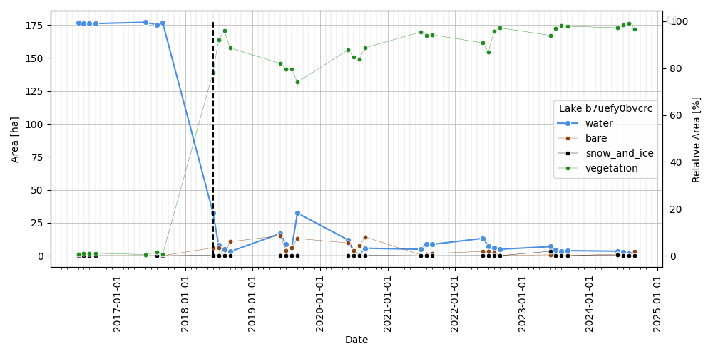
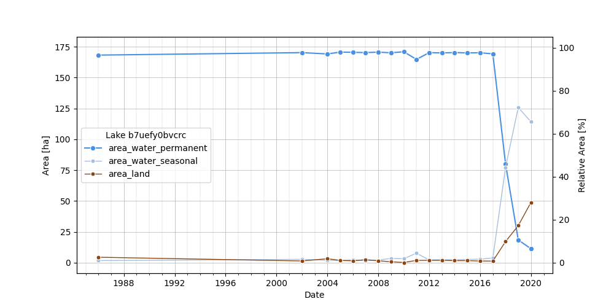

# water-timeseries-v2

Automated analysis of water timeseries data from satellite imagery and remote sensing sources.

## Documentation

**📖 Full Documentation**: [View Documentation](https://PermafrostDiscoveryGateway.github.io/water-timeseries-v2/)

The documentation includes:

- Getting started guide
- API reference (auto-generated from code)
- Usage examples
- Tutorial notebooks

Documentation is automatically built and deployed on every push to `main` using GitHub Actions.

## Features

- **Dynamic World Handler**: Process Dynamic World land cover classifications
- **JRC Water Handler**: Handle JRC water occurrence and classification data
- **Data Normalization**: Automatic normalization and scaling of time series
- **Breakpoint Detection**: Statistical (SimpleBreakpoint) and advanced (RBEAST) methods for detecting water extent changes
- **Batch Processing**: Efficient processing of multiple spatial entities
- **Comprehensive Testing**: Full test coverage including breakpoint detection, normalization, and integration tests

## Quick Start

### Python API

```python
from water_timeseries.dataset import DWDataset
import xarray as xr

# Load data
ds = xr.open_dataset("water_data.nc")

# Process with Dynamic World handler
processor = DWDataset(ds)

# Access time series
water_extent = processor.ds_normalized[processor.water_column]

# Access normalized time series
water_extent = processor.ds_normalized["water"]
```

### Command Line Interface

The package provides a hierarchical CLI tool `water-timeseries` for running breakpoint detection on water datasets.

#### Installation

```bash
# Using uv (recommended)
uv sync

# Or using pip
pip install .
```

#### Basic Usage

##### Show Help for cli

```bash
# Show help
uv run water-timeseries --help
```

##### Main CLI tools

```bash
# Show breakpoint-analysis-historical subcommand help
uv run water-timeseries breakpoint-analysis-historical

# Show breakpoint-analysis-historical subcommand help
uv run water-timeseries breakpoint-analysis-nrt

# Show plot-timeseries subcommand help
uv run water-timeseries plot-timeseries

# run dashboard
uv run water-timeseries dashboard
```

#### Using a Config File

You can also use a YAML configuration file:

```bash
uv run water-timeseries breakpoint-analysis-historical --config-file configs/config.yaml
```

Example config file for breakpoint-analysis-historical:

```yaml
# config.yaml
water_dataset_file: /path/to/data.zarr
output_file: /path/to/output.parquet

# Optional: vector dataset for bbox filtering
vector_dataset_file: /path/to/lakes.parquet

# Bounding box filter (optional)
bbox_west: -160
bbox_east: -155
bbox_north: 68
bbox_south: 66

# Processing options
chunksize: 100
n_jobs: 20
min_chunksize: 10
```

#### Breakpoint Analysis Historical

Run historical breakpoint analysis on water dataset. This command performs breakpoint detection on lake water area time series data to identify significant changes in water availability.

| Option | Short | Description | Default |
| -------- | ------- | ------------- | -------- |
| `water_dataset_file` | | Path to water dataset file in zarr or parquet format. Can be specified via CLI argument or config file | Required* |
| `output_file` | | Path to output parquet file where results will be saved. A YAML config file with the same name will also be created with the parameters used | Required* |
| `--config-file` | | Path to a YAML or JSON configuration file containing default parameters. CLI arguments take priority over config file values | `None` |
| `--vector-dataset-file` | `-v` | Path to vector dataset file (GeoParquet) containing lake boundary geometries for spatial analysis | `None` |
| `--chunksize` | `-c` | Number of lake IDs to process per chunk. Controls memory usage during parallel processing | `100` |
| `--parallel-backend` | | Parallelization backend to use. Options: "joblib" or "ray" | `ray` |
| `--break-method` | | Breakpoint detection method. Options: "simple" (rolling window statistical detector) or "beast" (Bayesian RBEAST-based detector) | `beast` |
| `--n-jobs` | `-j` | Number of parallel jobs. Use >1 for parallel processing | `1` |
| `--min-chunksize` | `-m` | Minimum chunk size for parallel processing | `10` |
| `--bbox-west` | | Western boundary of bounding box for spatial filtering (minimum longitude) | `None` |
| `--bbox-south` | | Southern boundary of bounding box for spatial filtering (minimum latitude) | `None` |
| `--bbox-east` | | Eastern boundary of bounding box for spatial filtering (maximum longitude) | `None` |
| `--bbox-north` | | Northern boundary of bounding box for spatial filtering (maximum latitude) | `None` |
| `--output-geometry` | | Whether to include geometry data in the output | `True` |
| `--output-geometry-all` | | Whether to include geometry for all lakes (not just those with breakpoints) | `True` |
| `--logfile` | | Path to log file | Auto-generated |
| `--verbose` | `-v` | Verbosity level. 0 = INFO (default), 1 or more = DEBUG | `0` |

*Can also be provided via config file

**Example usage:**

```bash
# Basic usage with required arguments
uv run water-timeseries breakpoint-analysis-historical tests/data/lakes_dw_test.zarr output.parquet

# With custom chunk size and parallel jobs
uv run water-timeseries breakpoint-analysis-historical tests/data/lakes_dw_test.zarr output.parquet -c 100 -j 20

# Using a configuration file
uv run water-timeseries breakpoint-analysis-historical --config-file configs/config.yaml

# Spatial filtering with bounding box
uv run water-timeseries breakpoint-analysis-historical data.zarr output.parquet \
    --bbox-west 100 --bbox-south 20 --bbox-east 110 --bbox-north 30
```

#### Breakpoint Analysis NRT

Pre-compute near real-time drained-lake results for one month or a date range.

**Single-month mode** (`--analysis-date`): runs for exactly one month and writes results to `--output-file`.

**Range mode** (`--analysis-date-start` + `--analysis-date-end`): runs for every month in the inclusive range and writes one parquet file per month to `--output-dir`, auto-named `nrt_<YYYY-MM>_drain_breaks.parquet`. Already-present files are skipped unless `--no-resume` is set.

| Option | Short | Description | Default |
| -------- | ------- | ------------- | -------- |
| `dataset_file` | | Path to the DW dataset file (`.ncin` / `.nc` NetCDF or `.zarr`) | **Required** |
| `--analysis-date` | | Single month to analyse, as `YYYY-MM` (e.g. `2024-01`). Mutually exclusive with `--analysis-date-start` / `--analysis-date-end` | `None` |
| `--analysis-date-start` | | First month of an inclusive range, as `YYYY-MM`. Must be used together with `--analysis-date-end` | `None` |
| `--analysis-date-end` | | Last month of an inclusive range, as `YYYY-MM`. Must be used together with `--analysis-date-start` | `None` |
| `--output-file` | | Destination parquet file (single-month mode only). Defaults to `nrt_<analysis_date>_drain_breaks.parquet` next to dataset_file | `None` |
| `--output-dir` | | Destination directory for range mode. One file per month is written as `nrt_<YYYY-MM>_drain_breaks.parquet`. Defaults to the parent directory of dataset_file | `None` |
| `--no-resume` | | Range mode only. When set, re-process months even if their output file already exists in `--output-dir` | `False` |
| `--drain-threshold` | | `water_residual` threshold below which a lake is classified as drained | `-0.25` |
| `--data-aggregation-period` | | Aggregation period for NRT analysis | `all` |
| `--lake-chunk-size` | | Lakes processed per chunk. Smaller = less RAM | `5000` |
| `--n-jobs` | `-j` | Parallel ARIMA workers per chunk. Reduce if RAM is tight | `4` |
| `--vector-file` | | Optional GeoParquet vector file. When provided, only the `id_geohash` values present in that file are processed | `None` |
| `--config-file` | | Path to a YAML or JSON configuration file containing default parameters. CLI arguments take priority over config file values | `None` |
| `--logfile` | | Path to log file | Auto-generated |
| `--verbose` | `-v` | Verbosity level (0 = INFO, 1 = DEBUG) | `0` |

**Example usage:**

```bash
# Single month
uv run water-timeseries breakpoint-analysis-nrt downloads/lakes_dw_V2d.nc \
    --analysis-date 2024-01 \
    --output-file precomputed/nrt/nrt_2024-01_drain_breaks.parquet

# Date range (one file per month written to --output-dir)
uv run water-timeseries breakpoint-analysis-nrt downloads/lakes_dw_V2d.nc \
    --analysis-date-start 2024-01 \
    --analysis-date-end 2024-06 \
    --output-dir precomputed/nrt

# Resume a previously interrupted range run
uv run water-timeseries breakpoint-analysis-nrt downloads/lakes_dw_V2d.nc \
    --analysis-date-start 2024-01 \
    --analysis-date-end 2024-12 \
    --output-dir precomputed/nrt

# Force re-process all months in range
uv run water-timeseries breakpoint-analysis-nrt downloads/lakes_dw_V2d.nc \
    --analysis-date-start 2024-01 \
    --analysis-date-end 2024-12 \
    --output-dir precomputed/nrt \
    --no-resume
```

#### Plot Timeseries

Plot time series for a specific lake.

| Option | Short | Description | Default |
| -------- | ------- | ------------- | -------- |
| `water_dataset_file` | | Path to water dataset file (zarr or netCDF). Can be specified via CLI argument or config file | Required* |
| `lake_id` | | Geohash ID of the lake to plot. Can be specified via CLI argument or config file | Required* |
| `--output-figure` | | Path to save the output figure | `None` |
| `--break-method` | | Break method to overlay (beast or simple) | `None` |
| `--config-file` | | Path to a YAML or JSON configuration file containing default parameters. CLI arguments take priority over config file values | `None` |
| `--show` | | Whether to display the plot | `True` |
| `--logfile` | | Path to log file | Auto-generated |
| `--verbose` | `-v` | Verbosity level (`-v` for DEBUG) | `0` |

*Can also be provided via config file

**Example usage:**

```bash
# Plot lake timeseries
uv run water-timeseries plot-timeseries data.zarr --lake-id b7uefy0bvcrc

# Save figure to file
uv run water-timeseries plot-timeseries data.zarr --lake-id b7uefy0bvcrc --output-figure plot.png

# Use config file
uv run water-timeseries plot-timeseries --config-file configs/plot_config.yaml

# Plot lake timeseries with break detection
uv run water-timeseries plot-timeseries tests/data/lakes_dw_test.zarr --lake-id b7uefy0bvcrc --output-figure examples/dw_example_b7uefy0bvcrc.png --break-method beast
```



```bash
# Plot lake timeseries with JRC data
uv run water-timeseries plot-timeseries tests/data/lakes_jrc_test.zarr --lake-id b7uefy0bvcrc --output-figure examples/jrc_example_b7uefy0bvcrc.png --break-method beast
```



#### Build PMTiles

Convert a lake GeoParquet file to a single `.pmtiles` archive for fast map rendering.

| Option | Short | Description | Default |
| -------- | ------- | ------------- | -------- |
| `vector_file` | | Path to input GeoParquet file with lake polygons | Required |
| `output_file` | | Path to output `.pmtiles` file | Required |
| `--viz-configuration` | | Visualization configuration for the map viewer. Valid options: `"colored_historical"` (historical time series with color-coded data), `"drainage_year"` (data displayed by drainage year), `"nrt_drainage"` (near-real-time drainage data) | `colored_historical` |
| `--keep-geojsonl` | | Keep intermediate GeoJSONL file after building PMTiles | `False` |
| `--config-file` | | Path to a YAML or JSON configuration file containing default parameters. CLI arguments take priority over config file values | `None` |
| `--logfile` | | Path to log file | Auto-generated |
| `--verbose` | `-v` | Verbosity level (`-v` for DEBUG) | `0` |

**Example usage:**

```bash
# Build PMTiles with default visualization (colored_historical)
uv run water-timeseries build-pmtiles lakes.parquet tiles/lakes.pmtiles

# Build PMTiles with drainage_year visualization
uv run water-timeseries build-pmtiles lakes.parquet tiles/lakes_drainage_year.pmtiles --viz-configuration drainage_year

# Build PMTiles with nrt_drainage visualization
uv run water-timeseries build-pmtiles lakes.parquet tiles/lakes_nrt_drainage.pmtiles --viz-configuration nrt_drainage

# Keep intermediate GeoJSONL file for debugging
uv run water-timeseries build-pmtiles lakes.parquet tiles/lakes.pmtiles --keep-geojsonl
```

**Prerequisites:** [tippecanoe](https://github.com/felt/tippecanoe) must be installed (`brew install tippecanoe`).

Upload the resulting `.pmtiles` file to object storage (S3, GCS, etc.) and pass `--pmtiles-url` to the dashboard, or use `--pmtiles-file` for local development.

## Main Classes

### Datasets

- **DWDataset**: Dynamic World land cover processor
- **JRCDataset**: JRC water classification processor

### Download

- **EarthEngineDownloader**: Download data from Google Earth Engine

### Breakpoints

- **SimpleBreakpoint**: Statistical breakpoint detection
- **BeastBreakpoint**: Advanced RBEAST-based detection

## Interactive Dashboard

The package includes an interactive Streamlit dashboard for visualizing lake polygons and time series data.

### Running the Dashboard

```bash
uv run water-timeseries dashboard
```

### Features

- **Map Viewer**: Interactive map displaying lake polygons from parquet files
- **Hover Tooltips**: View attributes (id_geohash, Area_start_ha, Area_end_ha, NetChange_ha, NetChange_perc)
- **Click Selection**: Click on a polygon to select it and view its time series
- **Time Series Plot**: Automatic visualization of water extent over time
- **Automatic Download**: If the selected lake's data is not in the cached dataset, it automatically downloads from Google Earth Engine
- **Popup View**: Click "Open Time Series in Popup" for a larger view
- **EE Project Config**: Set your Google Earth Engine project in the sidebar

### Dashboard Configuration

The dashboard accepts the following optional arguments:

| Parameter | Description | Default |
| ----------- | ------------- | --------- |
| `vector_file` | Path to vector dataset file (GeoParquet) | `tests/data/lake_polygons.parquet` |
| `dw_dataset_file` | Path to Dynamic World dataset file (zarr) | `tests/data/lakes_dw_test.zarr` |
| `jrc_dataset_file` | Path to JRC dataset file (zarr) | `tests/data/lakes_jrc_test.zarr` |
| `precomputed_nrt_dir` | Directory with pre-computed NRT parquet files. Auto-detected from `precomputed/nrt/` in the repo root when present | `None` |
| `offline_mode` | If set, disables Google Earth Engine download functionality. Use this when running without internet access or Earth Engine authentication | `False` |
| `ee_project` | Google Earth Engine project ID. Required for EE downloads | `None` |
| `dw_start_year` | Start year for Dynamic World dataset time series | `2017` |
| `dw_end_year` | End year for Dynamic World dataset time series | `2025` |
| `dw_start_month` | Start month (1-12) for Dynamic World dataset time series filtering | `6` (June) |
| `dw_end_month` | End month (1-12) for Dynamic World dataset time series filtering | `9` (September) |
| `viz_configuration` | Visualization configuration for the map viewer. Valid options: `"colored_historical"` (historical time series with color-coded data), `"drainage_year"` (data displayed by drainage year), `"nrt_drainage"` (near-real-time drainage data) | `colored_historical` |
| `port` | Port to run the dashboard on | `8501` |
| `logfile` | Path to log file | Auto-generated |
| `verbose` | Verbosity level (`-v` for DEBUG) | `0` (INFO) |
| `config_file` | Path to a YAML or JSON configuration file containing default parameters. CLI arguments take priority over config file values | `None` |

**Example usage:**

```bash
uv run water-timeseries dashboard
uv run water-timeseries dashboard --vector-file data/lakes.parquet --dw-dataset-file data/lakes.zarr
uv run water-timeseries dashboard --offline-mode
uv run water-timeseries dashboard --ee-project my-ee-project
uv run water-timeseries dashboard --dw-start-year 2017 --dw-end-year 2026
uv run water-timeseries dashboard --config-file configs/dashboard_config.yaml
```

**Example config file:**

```yaml
# dashboard with downloading time-series on the fly for 2017-2026 (May-October)
vector_file: notebooks_temporary/drain_2026-05_high_confidence.parquet
ee_project: my-ee-project
dw_start_year: 2017
dw_end_year: 2026
dw_start_month: 5
dw_end_month: 10
```

## Documentation Links

- [Getting Started](getting_started.md) - Installation and setup guide
- [Examples](examples.md) - Usage examples and tutorials
- [API Reference](api/index.md) - Complete API documentation

## Contributing

We welcome contributions! Please ensure you:

1. Add docstrings to new functions and classes (Google style)
2. Update documentation in the `docs/` folder
3. Run tests before submitting PRs

## License

[Add your license here]

## Author

Ingmar Nitze
